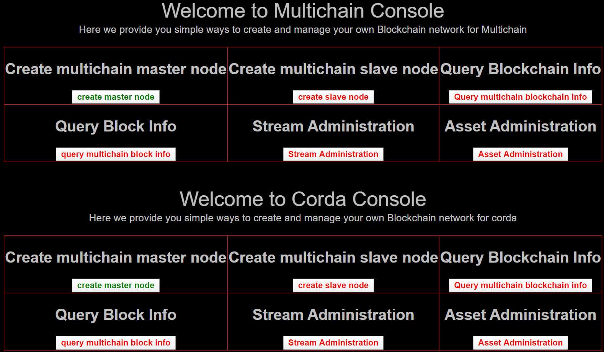
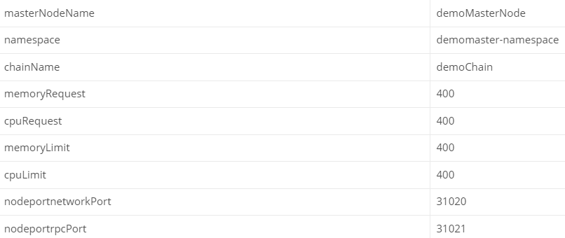
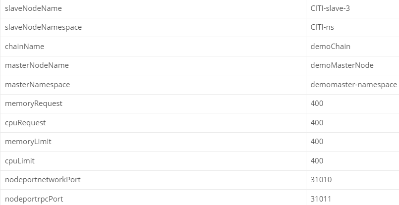
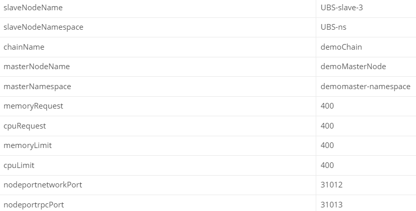
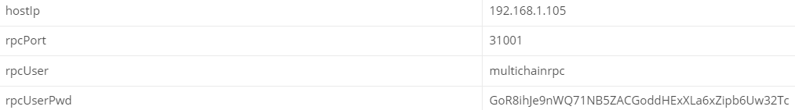

# BaasFrontConsole
This is the demo web console for MLBaaSPlatfrom

### Introduction
> This Simple Project is used to test the MLBaaSPlatform via Web Console. This is just a demo web console and don't have much consideration on the layout and the looking

### Preview
> Here i'm giving the preview of this web console as below

### How to setup the multichain network
##### 1: make sure you have you kubernetes env running
##### 2: make sure you have the kubernetes client start up and running on default port 8081 [don't forget to replace the actual kubernetes configuration content into the file kubectl.kubeconfig under resources folder]
##### 3: start up BaaSFrontConsole project and make sure it's running on default port 7071
##### 4: click "create master node" and give the configuration as below

##### 5: after the master node created successfully then move on to create the slave node
##### 6: return to index page and click on "create slave node" and give the configuration as below to create the first slave node

##### 7: return to index page and click on "create slave node" and give the configuration as below to create the second slave node

##### 8: then you have the 3-nodes multichain network setup and running if everything goes well
##### 9: here you can use the web console to operate the multichain network [before that you should make sure your multichain-client server is running on default port 9081]

### How to operate the multichain network
##### 1: you need to login to the docker container to get the rpcuser and rpcpassword value from multichain.conf file under "/home/multichain-demomasternode-k8s/data/demoChain" and "/home/multichain-citi-slave3-k8s/data/demoChain" and "home/multichain-ubs-slave3-k8s/data/demoChain"
#### 2: goto the web console and click on "Query multichain blockchain info" and click on the first "getBlockchainParams" and fill in below paras[don't forget to replace hostIp(node ip ,here i'm using linux vm) and rpcUserPwd with your actual values]

### Support or Contact
> If you have question please contact me via menglong567@aliyun.com